Getting Started
===============
sheetsync is a python library to create, update and delete rows of data within a google spreadsheet.

Installation
------------
Install from PyPi using `pip <http://www.pip-installer.org/en/latest/>`_, a
package manager for Python::

  pip install sheetsync

Or to develop this library further, you can clone the git repo and install::

  git clone git@github.com:mbrenig/sheetsync.git sheetsyncRepo
  pip install sheetsyncRepo

Note, you may need to run the commands above with ``sudo``.

Setting up OAuth 2.0 access
---------------------------
In `May 2015 <http://googledevelopers.blogspot.co.uk/2015/04/a-final-farewell-to-clientlogin-oauth.html>`_ Google retired old API access methods, and recommended users migrate to
`OAuth 2.0 <https://developers.google.com/identity/protocols/OAuth2?utm_campaign=oauth-415&utm_source=gdbc&utm_medium=blog>`_. OAuth2.0 is better for security and privacy 
but it means getting started with sheetsync involves a bit of extra configuration.

The steps below (written in 2015) guide you through API configuration and a simple script to manipulate a Google sheet. They will take around 15 minutes to complete.

.. warning:: This tutorial is designed to get you using sheetsync quickly. It is **insecure** because your client secret is stored in plain text. If someone obtains your client secret, they could use it to consume your quota, incur charges or request access to user data.

   Before using sheetsync in production you must learn about `Client IDs <https://developers.google.com/api-client-library/python/guide/aaa_oauth>`_ and replace the ``ia_credentials_helper()`` function with your own function that manages authentication and creates an `OAuth2Credentials <https://google-api-python-client.googlecode.com/hg/docs/epy/oauth2client.client.OAuth2Credentials-class.html>`_ object.

New Project
~~~~~~~~~~~
Start by setting up a new project via Google's developer console, `console.developers.google.com <https://console.developers.google.com>`_:

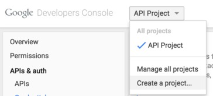

Pick a project name:

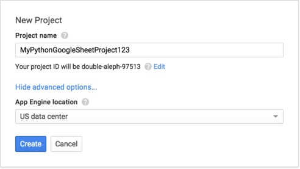

Create a new Client ID
~~~~~~~~~~~~~~~~~~~~~~
From your new project's configuration panel, in the console, select "Credentials"
from the lefthand menu and then "Create new Client ID" for OAuth:

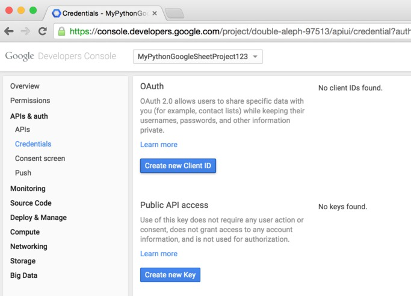

For this tutorial, choose the type Installed application:

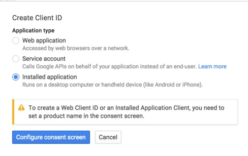

The consent screen is what users will see when the sheetsync script asks for
access to their Google drive. 

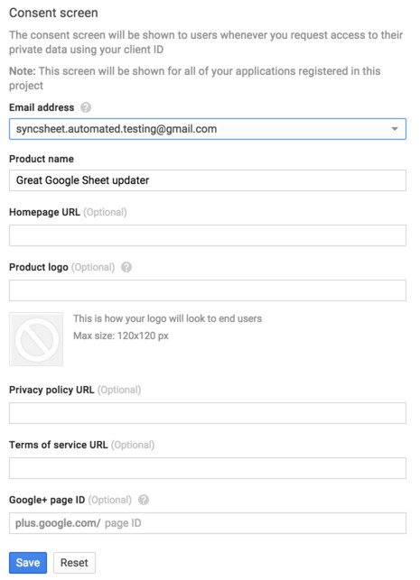

Finally select "Other" for Installed application type:

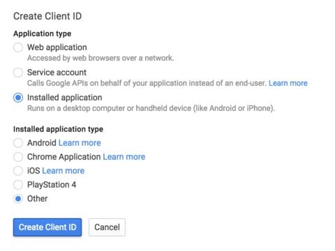

The steps above should have got to you a page that displays your new Client ID and
Client Secret. For example:

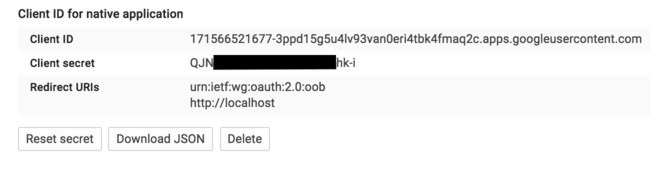

Enable Drive API
~~~~~~~~~~~~~~~~
Next we need to associate `Drive API <https://developers.google.com/drive/>`_ access with these OAuth credentials. From the lefthand menu choose API and search for Drive:

.. image:: oauth_imgs/08.FindDriveApi.jpg
   :width: 600px

Click through to the Drive API and "Enable API":

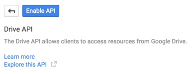

You're now ready to start using this Client ID information with sheetsync. 

Injecting data to a Google sheet
--------------------------------
sheetsync works with data in a dictionary of dictionaries. Each row is
represented by a dictionary, and these are themselves stored in a dictionary
indexed by a row-specific key. For example this dictionary represents two rows
of data each with columns "Color" and "Performer":

.. code-block:: python
   :linenos:

   data = { "Kermit": {"Color" : "Green", "Performer" : "Jim Henson"},
            "Miss Piggy" : {"Color" : "Pink", "Performer" : "Frank Oz"}
           }

To insert this data (add or update rows) with a target
sheet in a google spreadsheet document you do this:

.. code-block:: python
   :linenos:

   from sheetsync import Sheet, ia_credentials_helper

   # Create credentials, or recover from a cache.
   CLIENT_ID = '171566521677-3ppd15g5u4lv93van0eri4tbk4fmaq2c.apps.googleusercontent.com'
   CLIENT_SECRET = 'QJN*****************hk-i'
   creds = ia_credentials_helper(CLIENT_ID, CLIENT_SECRET, 
                                 credentials_cache_file='cred_cache.json')

   data = { "Kermit": {"Color" : "Green", "Performer" : "Jim Henson"},
            "Miss Piggy" : {"Color" : "Pink", "Performer" : "Frank Oz"} }

   # Find or create a spreadsheet, then inject data.
   target = Sheet(credentials=creds, document_name="sheetsync Getting Started")
   target.inject(data)
   print "Spreadsheet created here: %s" % target.document_href

The first part of this script (lines 1-7) imports the ``Sheet`` object and
``ia_credentials_helper`` function. This function is included to help you quickly
generate an `OAuth2Credentials <https://google-api-python-client.googlecode.com/hg/docs/epy/oauth2client.client.OAuth2Credentials-class.html>`_ object using your Client ID and Secret.

When the ``ia_credentials_helper`` function runs it will print a URL to allow
you to grant the script access, like this:

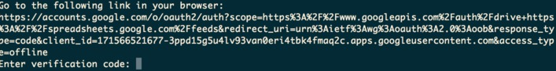

From this URL (you may have to log in to a Google Drive
account) you will be prompted to give the API Client you set up in section 1.2, access to your documents:

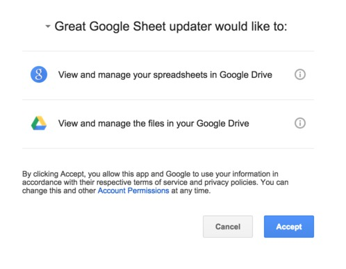

After accepting you're presented with a verification code that you must paste back into the
script:

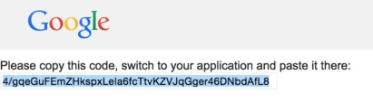

At this point ``ia_credentials_helper`` also caches the credentials - so that
you don't need to repeat this step on future runs of the script.

The later code defines the table data (lines 9,10) then line 13 
creates a new spreadsheet document in your google drive. 
Finaly line 14 inserts the data resulting in:

.. image:: Sheet1.png

It also prints the URL of the google sheet so you can view the result for
yourself.

Since you'll probably want to update this spreadsheet, take note of the
spreadsheet's document key from the URL:

.. image:: URL.png

and then inject new data by initializing the sheet as follows:

.. code-block:: python
   :linenos:

   target = Sheet(credentials=creds, 
                  document_key="1bnieREGAyXZ2TnhXgYrlacCIY09Q2IfGXNZbjsvj82M")

.. note::
   The 'inject' method only adds or updates rows. If you want to delete rows from the spreadsheet to keep it in sync with the input data then use the 'sync' method described in the next section.

