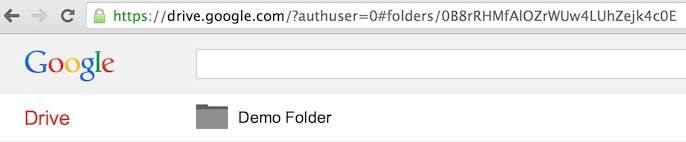
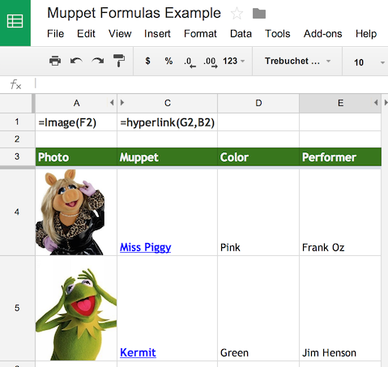

Welcome to SheetSync!
=====================
A python library to create, update and delete rows of data within a google spreadsheet.

Installation
------------
Install from PyPi using `pip <http://www.pip-installer.org/en/latest/>`__, a
package manager for Python.::

  pip install sheetsync

Or to develop this library further, you can clone the git repo and install::

  git clone git@github.com:mbrenig/SheetSync.git SheetSyncRepo
  pip install SheetSyncRepo

Note, you may need to run the commands above with ``sudo``.

Getting Started
---------------
SheetSync works with data in a dictionary of dictionaries. Each row is
represented by a dictionary, and these are themselves stored in a dictionary
indexed by a row-specific key. For example:

.. code-block:: python

    data = { "Kermit": {"Color" : "Green", "Performer" : "Jim Henson"},
             "Miss Piggy" : {"Color" : "Pink", "Performer" : "Frank Oz"}
            }

To insert this data (add or update rows) with a target
sheet in a google spreadsheet document you do this:

.. code-block:: python

    import sheetsync
    # Get or create a spreadsheet...
    target = sheetsync.Sheet(username="googledriveuser@domain.com", 
                             password="app-specific-password",
                             document_name="Let's try out SheetSync")
    # Insert or update rows on the spreadsheet...
    target.inject(data)
    print "Review the new spreadsheet created here: %s" % target.document_href

This creates a new spreadsheet document in your google drive and then inserts the data like so:

.. image:: Sheet1.png

Later on you'll probably want to access this data, to do that note the
spreadsheet's document key from the URL:

.. image:: URL.png

and access the data as follows:

.. code-block:: python

    source = sheetsync.Sheet(username="googledriveuser@domain.com",
                             password="app-specific-password",
                             document_key="1bnieREGAyXZ2TnhXgYrIacCIY09Q2lfGXNZbjsvJ82M")
    print source.data()

The 'inject' method only adds or updates rows. If you want to delete rows from the spreadsheet to keep it in sync with the input data then use the 'sync' method described in the 'Synchronizing data' section below.

Getting Silly
-------------
Let's extend this example, and use more of SheetSync's features. (With apologies
in advance to the Muppets involved).

Key Column Headers
~~~~~~~~~~~~~~~~~~
The first thing we'll fix is that top-left cell with the value 'Key'. The keys
for our data are Names and the column header should reflect that. This is easy
enough to do with the key_column_headers field:

.. code-block:: python

    target = sheetsync.Sheet(username="googledriveuser@domain.com",
                             password="app-specific-password",
                             document_name="Muppet Show Tonight",
                             key_column_headers=["Name"])

Templates for Formatting
~~~~~~~~~~~~~~~~~~~~~~~~
Google's spreadsheet API doesn't currently allow control over 
cell formatting, but you can specify a template template spreadsheet that has the 
formatting you want - and use SheetSync to add data to a copy of the template.
Here's a template spreadsheet created to keep my list of Muppets:

.. image:: Template01.png
https://docs.google.com/spreadsheets/d/1J__SpvQvI9S4bW-BkA0PmPykH8VVT9bdoWZ-AW7V_0U/edit#gid=0

The template's document key is '1J__SpvQvI9S4bW-BkA0PmPykH8VVT9bdoWZ-AW7V_0U' we can instruct
SheetSync to use this as a basis for the new spreadsheet it creates as follows:

.. code-block:: python

    target = sheetsync.Sheet(username="googledriveuser@domain.com",
                             password="app-specific-password",
                             document_name="Muppet Show Tonight",
                             sheet_name="Muppets",
                             template_key="1J__SpvQvI9S4bW-BkA0PmPykH8VVT9bdoWZ-AW7V_0U",
                             key_column_headers=["Name"])

Note that I've also specified the worksheet name in that example with the 
'sheet_name' parameter.

Folders
~~~~~~~
If you use folders to organize your Google drive, you can specify the folder a
new spreadsheet will be created in. Use either the 'folder_name' or 'folder_key' parameters. 
Here for example I have a folder with the key "0B8rRHMfAlOZrWUw4LUhZejk4c0E":

and instruct SheetSync to move the new spreadsheet into that folder with this
code:

.. code-block:: python

    target = sheetsync.Sheet(username="googledriveuser@domain.com",
                             password="app-specific-password",
                             document_name="Muppet Show Tonight",
                             sheet_name="Muppets",
                             key_column_headers=["Name"],
                             template_key="1J__SpvQvI9S4bW-BkA0PmPykH8VVT9bdoWZ-AW7V_0U",
                             folder_key="0B8rRHMfAlOZrWUw4LUhZejk4c0E")

Formulas
~~~~~~~~
Often you'll need some columns to contain formulas that depend on data in other columns, and when new rows are inserted by SheetSync, ideally you'd want those formulas to be added too.
When initializing the spreadsheet you can specify a row (typically above the
header row) that contains reference formulas. Best illustrated by this example

https://docs.google.com/spreadsheets/d/1tn-lGqGHDrVbnW2PRvwie4LMmC9ZgYHWlbyTjCvwru8/edit#gid=0

Here row 2 contains formulas (Written out in row 1 for readability) that
reference hidden columns. Row 3 contains the headers. 

When new rows are added to this spreadsheet the 'Photo' and 'Muppet' columns will be populated with a formula similar to the reference row. Here are the parameters to set this up:

.. code-block:: python

    target = sheetsync.Sheet(username="googledriveuser@domain.com",
                             password="app-specific-password",
                             document_key="1tn-lGqGHDrVbnW2PRvwie4LMmC9ZgYHWlbyTjCvwru8",
                             sheet_name="Muppets",
                             key_column_headers=["Name"],
                             header_row_ix=3,
                             formula_ref_row_ix=2)

    animal =  {'Animal': {'Color': 'Red',
                          'Image URL': 'http://upload.wikimedia.org/wikipedia/en/e/e7/Animal_%28Muppet%29.jpg',
                          'Performer': 'Frank Oz',
                          'Wikipedia': 'http://en.wikipedia.org/wiki/Animal_(Muppet)'} }

    target.inject(animal)

Synchronizing data
~~~~~~~~~~~~~~~~~~
Until now all examples have used the 'inject' method to add data into a spreadsheet or
update existing rows. As the name suggests, SheetSync also has a 'sync' method which
will make sure the rows in the spreadsheet match the rows passed to the
function. This might require that rows are deleted from the spreadsheet.

The default behavior is to not actually delete rows, but instead flag them for
deletion with the text "(DELETED)" being appended to the values of the Key columns on rows to delete. This is to help recovery from accidental deletions. Full row deletion can be enabled by passing the flag_deletes argument as follows:

.. code-block:: python

    target = sheetsync.Sheet(username="googledriveuser@domain.com",
                             password="app-specific-password",
                             document_key="1J__SABCD1234bW-ABCD1234kH8VABCD1234-AW7V_0U",
                             sheet_name="Muppets",
                             key_column_headers=["Name"],
                             flag_deletes=False)

    new_list = { 'Kermit' : { 'Color' : 'Green',
                              'Performer' : 'Jim Henson' },
                 'Fozzie Bear' : {'Color' : 'Orange' } }
                                
    target.sync( new_list )

With rows for Miss Piggy and Kermit already in the spreadsheet, the sync
function (in the example above) would remove Miss Piggy and add Fozzie Bear.

Taking backups
--------------
Couldn't the sync function delete all my rows? **Yes it could!**

Some simple mistakes can cause bad results. For instance, if the key column headers on the spreadsheet don't match those passed to the Sheet constructor the sync method will delete all the existing rows and add new ones! You could protect rows and ranges to guard against this, but perhaps the simplest way to mitigate the risk is by creating a backup of your spreadsheet before syncing data. Here's an example:

.. code-block:: python

    target.backup("Backup of my important sheet. 16th June",
                  folder_name = "SheetSync Backups.")

This code would take a copy of the entire spreadsheet that the Sheet instance 'target'
belongs to, name it "Backup of my important sheet. 16th June", and move it to a
folder named "SheetSync Backups.".

Debugging 
---------
SheetSync uses the standard python logging module, the easiest way to find
out what's going on under the covers is to turn on all logging:

.. code-block:: python

    import sheetsync
    import logging
    # Set all loggers to DEBUG level..
    logging.getLogger('').setLevel(logging.DEBUG)
    # Register the default log handler to send logs to console..
    logging.basicConfig()

If you find issues please raise them on `github
<http://github.com/mbrenig/SheetSync/issues>`_, and if you have fixes please
submit pull requests. Thanks!
